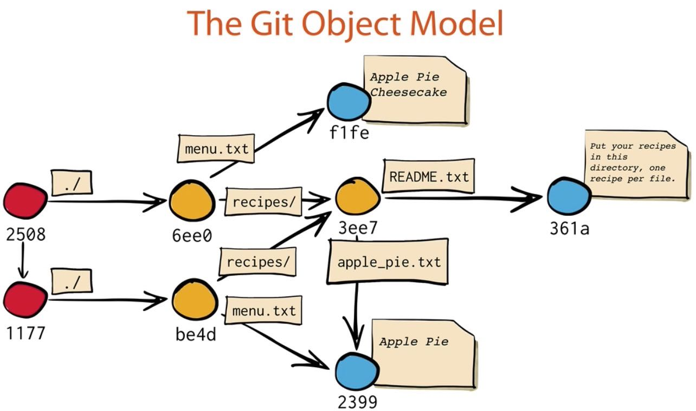

I have been using Git for some time but mostly limited to basic commands. So this Easter break I spent time to dive into its internals in an effort to understand it more.

## The Core
At its core, Git is a map (a table with keys and values). Git calculates a key based on a given value using SHA1 algorithm. You can see how Git calculates a hash key by this command.
```
echo 'Dennis' | git hash-object --stdin
```
This generated SHA1 hash will be a key to store content, which can be found under **.git/objects** folder. You can use a plumbing command **cat-file -p hashKey** to peek into the content.
```
git cat-file -p 23991897e13e47ed0adb91a0082c31c82fe0cbe5

tree 4a7d45bff015a57027e0061aabf443aac8acb6d6
parent 5afc7dc24f1d8395371b0b79d420770935f121a2
```
Blob is the content in a file.
Tree is the equivalent of a directory in a file system.
Parent is used for versioning, refering to the previous version.



## Branches
Git branch is nothing but a reference to a commit. You can find all the branches in **./git/refs/heads**, and the current branch reference is stored in **./git/HEAD** file. It is important to note that the HEAD reference will always refer to the current active branch.

When you try to merge two branches using the command **git merge branch-name**, you acutally create a new commit with two parent references. In addition, when you checkout a branch or a commit, Git actually grabs all the trees and blobs that the particular branch or commit is linked to, and places them into your working area.

One particular 'scary' case is when you checkout a commit, which will result in a **detached HEAD**. If you work in a detached HEAD mode, all your commits will be destroyed by the garbage collector if you do not give it a branch name using **git branch branch-name**. The reason that these detached commits would be earsed is that you would have no way to refer to them in the future unless you remember exactly their SHA1 hash keys, which is just impossible for any human being.


## Rebase

Rebase is another way of 'merging'. To put it simply, rebase moves commits of one branch on top of the other branch. This would streamline the hisotry so you can get a 'linear' history record. However, this history lies because rebase kind of squeezes two branches into one and does not preserve their integrity.

To sum up, merges preserve history. Rebases refactor history. 

