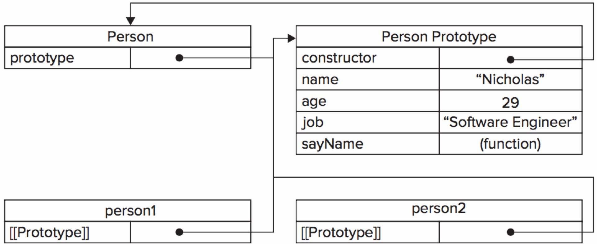

Prototype has been a big confusion for many developers as it differs dramatically from the well-known class-based inheritance pattern implemented by object oriented programming languages.

Examine the following code and its figure. 

```
function Person() {}

Person.prototype.name = "Dennis";
Person.prototype.age = 29;
Person.prototype.job = "Engineer";
Person.prototype.sayName = function() {
	console.log(this.name);
}

var person1 = new Person();
var person2 = new Person();
```



Every time a function is created (Person), it would automatically get a prototype property, which is an object (Person Prototype). The Person Prototype gets a `constructor` property by defult, which points back to the function on which it is a property.

Any Person instance (person1, person2) has a hidden link to its constructor's prototype (implemented by many browsers as `__proto__` property). It's important to note that the instance of Person has no direct connection with its constructor.

```
person1.__proto__ === person1.constructor.prototype
```

You can check the relationship by using `isPrototypeOf()` method.

```
Person.prototype.isPrototypeOf(person1)  // true
```

Another useful method is `Object.getPrototypeOf()`, which retrieves the value of `__proto__`.

```
Object.getPrototypeOf(person1) === Perosn.prototype; // true
Object.getPrototypeOf(person1).name; // "Dennis"
```

However, if we rewrite the prototype object using object literal syntax, the constructor property will lose the relationship with the constructor function.

```
function Person() {};

Person.prototype = {
	constructor: Person, // explicitly create a relationship
	name: "Dennis",
	sayName: function() {
		console.log(this.name);
	}
}
```

This wraps up an introduction to Javascript prototypes. I would recommend the book [Professional Javascript for Web Developers](https://www.amazon.com/Professional-JavaScript-Developers-Nicholas-Zakas/dp/1118026691/ref=sr_1_1?ie=UTF8&qid=1493281156&sr=8-1&keywords=Professional+Javascript+for+Web+Developers "Professional Javascript for Web Developers") for more in-depth knowledge.